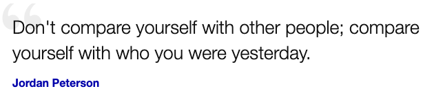

# Advent Of Code '2021

My [adventofcode.com](https://adventofcode.com) adventures. 
Older ones: [2020](https://github.com/valango/adventOfCode),
[2015](https://github.com/valango/AdventOfCode_2015).

## Diary

* `day 01:` Joined the races, with just 16 hrs of delay 🐌🐌🐌
* `day 02:` So far, its all trivial. Joined by afternoon 🐌, actual time 23min.
* `day 03:` Actually simple stuff, but it really took some focussing (101min).
* `day 04:` A nice one. Some time was lost for misreading the input format.
* `day 05:` Simple, but... man, I hate numbers - I just can't _see_ them!.
* `day 06:` Now, this was a good lesson - I lost at least 30mins implementing
  _an illustration of example_, rather than the actual logic of the process. 🤬
* `day 07:` This seemingly trivial puzzle left me clueless - I just could not 👁👁 visualize the
  problem! Only when I figured out it is like finding a balance point for a bar with suspended
  weights⚖️, everything became clear, finally.
* `day 08:` Wasted too much time working on description details. Succeeded debugging of code #2 only
  after using simplified datasets.
* `day 09:` Made _a lot_ of mistakes. 🤡
* `day 10:` A recipe for immediate failure: _"Oh, I know how to do that!"_.

## Track record

My ranking placements and final times for puzzle 1 and 2 by days. 
**Others** is number of solvers of both puzzles and **Just 1** of those who had solved only the
first one, taken from
[global stats](https://adventofcode.com/2021/stats) when I completed.

| day | Rank 1 | Time 1 | Rank 2 | Time 2 | Others | Just 1|
| ---: | ---: | :---: | ---: | :---: |---: |---: |
| 1 | 87733 | 16:09:30 | 77832 | 16:26:49 |127445|14909|
| 2 | 58863 | 08:21:25 | 55421 | 08:26:51 |106584|4125|
| 3 | 8808 | 00:25:36 | 10369 | 01:41:35 |45825|23066|
| 4 | 4087 | 00:41:37 | 4896 | 01:06:05 |6191|1630|
| 5 | 8539 | 01:18:17 | 7974 | 01:44:41 |8093|1972|
| 6 | 8567 |00:30:44 | 7349 | 01:06:45 |7484|4379|
| 7 | 16732 | 01:54:24 | 15841 | 02:05:48 |15930|1773|
| 8 | 9645 | 00:41:25 | 17577 | 07:04:10 |15930|1773|
| 9 | 9219 | 00:51:40 | 8295 | 01:55:16 |8308|5105|
| 10 | 9915 | 01:12:20  | 10966 | 02:00:54 |10982|1716|

## Code

The project codebase consists of daily puzzle files named like `day01.js`, universal runner code and
module tests for runner code.

### Performance report

The following report was generated using command `./run abm`.

| day|main#1|main#2|µs1|µs2|demo#1|demo#2|µs1|µs2|
|---:|---:|---:|---:|---:|---:|---:|---:|---:|
|01|1759|1805|90|242|7|5|72|43|
|02|2073315|1840311528|1229|340|150|900|61|71|
|03|3309596|2981085|583|2573|198|230|118|986|
|04|82440|20774|296|50627|4512|1924|228|56|
|05|8622|22037|44577|52433|5|12|187|91|
|06|362346|1639643057051|32755|284|5934|26984457539|3082|417|
|07|345035|97038163|3185|3950|37|168|133|143|
|08|344|1048410|151|453466|26|61229|84|36007|
|09|417|1148965|8595|15667|15|1134|217|3923|
|10|341823|2801302861|6336|18650|26397|288957|268|547|

### Usage

After installing with npm or yarn, just type `./run` and the puzzles from the most recent puzzle
file will be executed.

The following command line parameters apply:

* integer - day number(s), (default: most recent day only);
* a: all days;
* b: both datasets (default: main data only);
* d: example data only (mutually exclusive with 'b' option;
* h: print help information and terminate;
* j: generate output as JSON-formatted rows;
* m: generate markdown output (default: text table for multiple, JSON for single puzzle).

If neither 'b' nor 'd' is present, only the main dataset is used. If 'd' is present, and demo data
is not defined, it falls back to main dataset.

### Coding

To start with a new puzzle for, say, _day 14_, do:
1. copy the contents of [template.js](./template.js) to `day14.js`;
1. create `day14.txt` in `./data` directory and populate it with data from the website;
1. have fun!

It is recommended to copy the puzzle data into a text file in `data` folder.

### Debugging

**To trap failed assertions** when debugging, set a breakpoint to
[runner/index.js](./runner/index.js) line #20.
